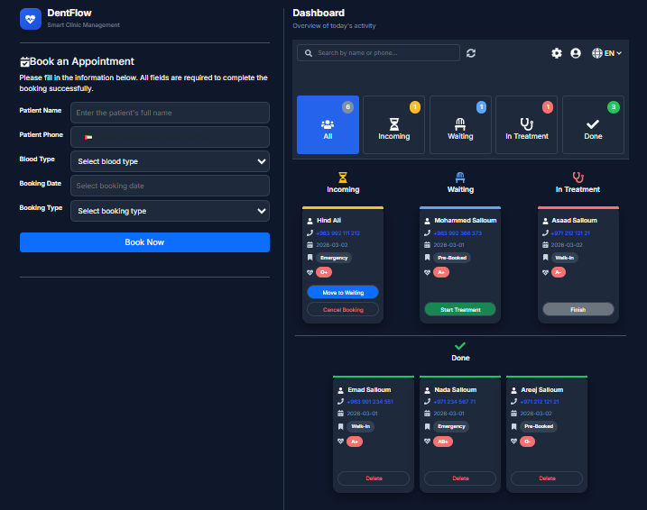
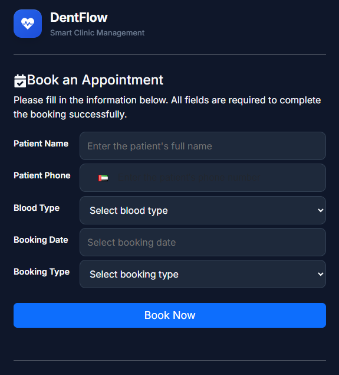
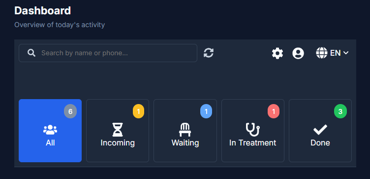
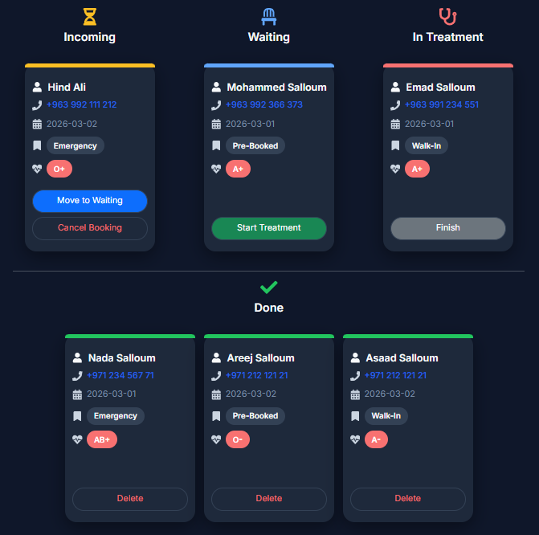
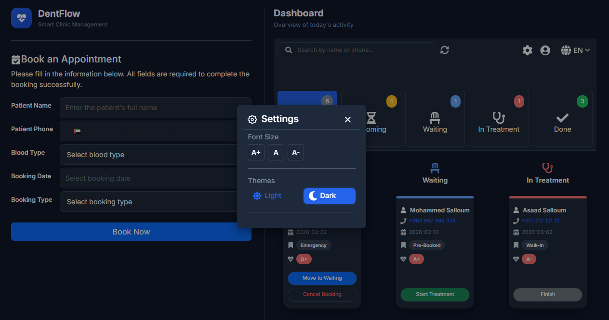

# 🦷 DentFlow | Smart Dental Clinic Management System

💼 **Personal Project | March 2026**

DentFlow is a fully responsive, bilingual dental clinic management system built with React & TypeScript.  
It simulates a real-world clinic workflow with state-driven patient lifecycle management and advanced UI customization features.

Designed with performance, accessibility, multilingual support, theme control, and SEO optimization.

---

## 🚀 Live Demo

🌐 [Live Application](https://dent-flow-ae.web.app/en)

---

## ✨ Core Highlights

- 🦷 Complete patient lifecycle management
- 🌍 Arabic / English with automatic RTL/LTR switching
- 🎨 Light & Dark theme support
- 🔤 Dynamic font family & font size control
- 📱 Fully responsive (Mobile / Tablet / Desktop / Landscape)
- 🔎 SEO optimized with Open Graph & Twitter meta tags
- 🚀 Production-ready deployment (Firebase Hosting)

---

## 🔧 Tech Stack

- ⚛️ React (Functional Components + Hooks)
- 🔒 TypeScript
- 🔄 React Router
- 📝 react-hook-form + Yup
- 🌐 i18next (multilingual + RTL)
- 🎨 Bootstrap 5 + Custom CSS Theme
- 🖋 Google Fonts (Inter / Cairo)
- 📅 react-datepicker
- 📞 libphonenumber-js
- 💾 localStorage
- 🔗 React Context API (Language, Theme, Font Management)

---

## 🌟 Features

### 🏥 Patient & Booking Management
- Add patients with advanced validation
- Status-based workflow (Incoming → Waiting → In Treatment → Done)
- Dynamic actions based on patient state
- Cancel, delete, or update records
- Confirmation modals for destructive actions

### 🌍 Bilingual & RTL System
- Arabic / English toggle with automatic direction switching
- Translated labels, placeholders, validation errors
- Dedicated font per language

### 🎨 Theme & Accessibility
- Light / Dark mode
- Adjustable global font size
- Switchable font family
- Accessible UI with clean contrast

### 📅 Advanced Booking Form
- Name validation (2–4 words)
- Syria-based phone validation
- Blood type & booking type selection
- Future dates only

### 📱 Responsive Design
- Optimized for all screen sizes & landscape
- Bootstrap grid + custom layout logic
- Status color indicators
- Smooth routing transitions

---

## 🔎 SEO & Social Media

- Meta description
- Open Graph tags (Facebook / LinkedIn / WhatsApp)
- Twitter Card support
- OG image optimized (1200x630)
- Canonical URL & viewport setup
- Locale support (en_US / ar_AR)

---

## 📸 Screenshots

| 🦷 Dent Flow |
|-------------|
|  |

| ➕ Booking Form |
|-------------|
|  |

| 🏠 Dashboard |
|-------------|
|  |

| 📝 Patient Card |
|-------------|
|  |

| ⚙️ Settings Panel |
|-------------|
|  |

---

## 🛠 Installation & Build

```bash
# Clone repository
git clone https://github.com/mohammed-salloum/dentflow.git
cd dentflow

# Install dependencies
npm install

# Start development
npm run dev

# Build production version
npm run build

# Preview production build
npm run preview
```

---

## 📂 Repository

Full source code and project files are available here:  

👉 [DentFlow — GitHub Repository](https://github.com/mohammed-salloum/DentFlow.git)

---

## 👨‍💻 Author

**Mohammed Salloum**  
Front-End React Developer  

📧 Email: mohammed.e.salloum@gmail.com  
🔗 LinkedIn: https://linkedin.com/in/mohammed-salloum-dev
